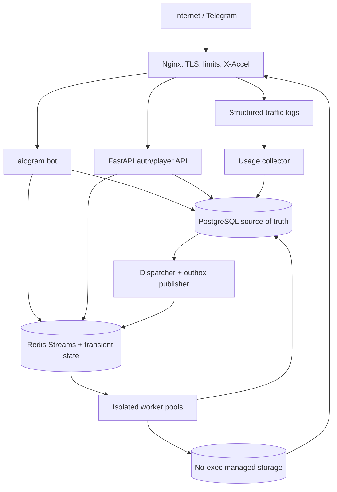

# Stage 1 — Production Architecture Baseline

**Project:** `mdlbot`  
**Status:** Proposed architecture baseline; implementation is intentionally deferred until the exact instruction `Stage 2`  
**Scope:** Requirements, constraints, threat model, system architecture, flows, data-model inventory, security decisions, risks, and repository layout only

This document is the complete Stage 1 deliverable. It does not contain application source files, migrations, container manifests, or placeholder implementations. The baseline becomes the implementation contract when Stage 2 is authorized. Any later change to the core technology stack, durable data model, queue model, security boundaries, or bilingual UI contract requires explicit approval.

## 1. Final requirements summary

The system is a self-hosted Telegram file-ingestion, direct-download, and media-streaming platform with these guarantees:

- It accepts Telegram files and external HTTP/HTTPS URLs, persists durable job state, stores completed files outside the application tree, and issues revocable opaque links.
- It returns an external file to Telegram only when the active Telegram API mode and verified upload policy permit it; otherwise it exposes direct download and compatible streaming.
- It supports `Range` requests, resume, progressive media playback, optional HLS, actual egress accounting, bounded concurrency, and configurable retention.
- It has normal/VIP plans, multiple quota windows, atomic reservations, fair priority scheduling, and explicit anti-starvation behavior.
- PostgreSQL is the source of truth. Redis Streams transports dispatched work, Redis holds transient progress/counters/locks, and no critical state exists only in Redis or process memory.
- It includes forced membership, public-channel review/publishing, broadcasts, tickets, restrictions, strikes, appeals, multi-admin RBAC, central settings, audit logs, backups, migration, monitoring, and a secure installer.
- Every user-facing and Telegram-admin-facing string exists in Persian (`fa`) and English (`en`). After selection, each actor sees only their own language. Public posts use an independently configured `fa`, `en`, or `bilingual` mode.
- The deployment uses Python 3.12, aiogram 3.x, FastAPI, SQLAlchemy 2.x, Alembic, PostgreSQL, Redis Streams, Nginx/X-Accel-Redirect, FFmpeg/FFprobe, Telegram Local Bot API, Docker Engine/Compose, Fluent, and pytest.
- OpenAI APIs are not a runtime dependency. No OpenAI API key or OpenAI model is needed for this Telegram bot.

## 2. Real limitations and acceptance boundaries

| Capability | Production decision | Real limitation / fallback |
|---|---|---|
| Local Bot API download | Recommended production mode; consume the absolute local path when available | Telegram documents local-server downloads without a size limit, but local disk, Telegram behavior, and project plan limits still apply |
| Local Bot API upload | Default verified ceiling: 2,000 MB, stored in a capability registry tied to the pinned server version/mode | There is no reliable Bot API method that dynamically returns the maximum upload size. Configuration/version evidence is authoritative; uncertain mode fails conservatively |
| Cloud Bot API download | Enforce the documented `getFile` ceiling (currently 20 MB) | Larger Telegram-source ingestion requires Local Bot API |
| Cloud Bot API upload | Enforce the documented bot upload ceiling (currently 50 MB) for new uploads | Larger results receive a direct link; previously stored `file_id` reuse is a separate operation and must not be represented as a new upload |
| User-to-Telegram upload progress | Show “waiting for Telegram” until the update is delivered | Bot API does not expose byte progress while the user uploads to Telegram. The bot must never fabricate a percentage |
| Server-side Telegram ingest progress | Report actual bytes when copying/reading a Telegram file into managed storage | If Local Bot API already exposes a complete file on the same filesystem, there may be no meaningful network-transfer phase; show verifying/importing instead |
| External HTTP download progress | Exact transferred bytes; percentage/ETA only when total size is known | `Content-Length` is untrusted. Unknown length shows bytes/speed without a fake percentage and stops at the real limit |
| Upload back to Telegram progress | Report bytes written by our client to Local Bot API plus a final “Telegram processing” phase | Bytes accepted by the local HTTP endpoint are not proof that Telegram has finished processing; completion is only the successful Bot API response |
| Queue position and ETA | Display a current estimate | Fair scheduling, cancellations, retries, and VIP arrivals make exact position/ETA impossible; UI labels them as estimates |
| Direct-link sharing prevention | Detect, throttle, bind optionally, limit, and revoke | A recipient can still share a capability URL or downloaded bytes; absolute prevention is impossible |
| Malware detection | Layered file isolation plus optional/mandatory ClamAV policy | ClamAV cannot guarantee a file is safe. Scan failure is fail-closed for public content |
| Browser playback | Direct play when compatible, then remux, then restricted transcode/HLS | Codec/browser support varies; not every file is streamable without expensive transcoding |
| HLS protection | Short-lived, quality-bound segment authorization | HLS is not DRM and cannot prevent capture by an authorized viewer |
| DDoS protection | Application/Nginx controls plus support for an upstream protected provider | Host controls cannot protect a saturated datacenter link |
| Public-content legality | User attestation, review, reports, takedown, blocklists, audit | The system cannot automatically establish copyright ownership or legality |
| Lightweight migration | Preserve database/configuration, not uploaded user bytes | Restored file records become unavailable, links/sessions are revoked, and users must resubmit files |

Authoritative Telegram references for the values above:

- Telegram Bot API, including Local Bot API capabilities and `getFile`: https://core.telegram.org/bots/api
- Telegram Bots FAQ, including cloud upload/download limits and broadcast guidance: https://core.telegram.org/bots/faq
- Official Local Bot API server and migration notes: https://github.com/tdlib/telegram-bot-api

Capability handling is deliberately conservative:

1. Record `api_mode`, pinned image digest/version, configured upload ceiling, cloud/local endpoints, verification timestamp, and verification source in `telegram_api_capabilities`.
2. On startup, validate endpoint health and expected mode. A version mismatch marks capability status `unverified` and uses the stricter safe policy.
3. Before every upload, compare actual on-disk size with the active verified ceiling and plan policy. Never “try and see” with an oversized file.
4. Operators update the registry only through a validated setting/deployment change after reviewing current official documentation and running a controlled smoke test.

## 3. Architecture principles

1. **Durable truth first:** authoritative users, jobs, reservations, files, permissions, settings, sessions, usage, and final results live in PostgreSQL.
2. **At-least-once transport, idempotent effects:** Redis Streams may deliver a message more than once. Database state transitions, unique idempotency keys, leases, and output naming make repeated delivery safe.
3. **Transactional outbox:** changes that require a Redis dispatch/event also create an outbox row in the same PostgreSQL transaction. Publication may repeat but cannot silently disappear.
4. **Least privilege by service:** public ingress, external internet access, Telegram credentials, database access, media parsing, file delivery, and backup keys are separated.
5. **Application authorization before Nginx delivery:** Nginx serves bytes, while FastAPI validates links/sessions/ranges and returns internal X-Accel routes.
6. **Fail closed at trust boundaries:** ambiguous URLs, unverified API capability, invalid permissions, missing scan results for public content, stale tokens, and inconsistent file state are rejected.
7. **Bounded resource use:** every operation has byte, time, connection, process, memory, CPU, file-descriptor, retry, and queue bounds.
8. **No user file execution or web rendering:** uploaded bytes never enter source paths and are never served as active HTML/SVG/XML/PDF/Office content.
9. **Localization is a build invariant:** missing/mismatched Fluent messages fail CI and production startup rather than mixing languages.
10. **Observable and reversible administration:** sensitive actions are authorized at execution time, confirmed, audited, and reversible where the operation permits.

## 4. Final service architecture



### 4.1 Service responsibilities

| Service | Responsibility and privilege boundary |
|---|---|
| `nginx` | Only public HTTP service on 80/443; TLS, host validation, reverse proxy, auth subrequests, X-Accel delivery, Range policy, request/connection/rate limits, headers, structured traffic logs |
| `bot` | aiogram commands/callbacks/FSM, language selection, menus, forced-membership checks, user/admin interactions; no large file-body delivery |
| `api` | Link/session validation, player pages, Range authorization, webhook endpoint, health/readiness, and narrowly scoped internal worker-report endpoints |
| `dispatcher` | Select eligible PostgreSQL jobs, apply fair priority/aging, create dispatch generations/outbox events, publish to Redis Streams |
| `external-download-worker` | Only outbound HTTP/HTTPS ingestion; no bot/API secrets, no direct DB credentials, no Telegram network, restricted report endpoint/token, strict egress firewall |
| `telegram-download-worker` | Import Local Bot API files into managed storage; has Telegram credential/path access only as necessary and a scoped job-report channel |
| `telegram-upload-worker` | Verify capability/size again immediately before upload; upload eligible files and persist the Bot API outcome idempotently |
| `media-worker` | FFprobe, compatibility decision, remux, controlled transcode, thumbnails, HLS; sandboxed parser with read-only inputs and constrained outputs |
| `cleanup-worker` | Expiration state machine, token/session revocation, file/variant/segment deletion, orphan and `.part` cleanup, storage reconciliation |
| `broadcast-worker` | Resumable, rate-limited copy/forward/send operations with per-user-language routing and durable results |
| `scheduler` | Reservation/session/job lease reconciliation, VIP expiry, recurring cleanup, backup triggers, stale work recovery, retention transitions |
| `usage-collector` | Consume Nginx JSON logs, update near-real-time Redis counters, batch actual bytes to PostgreSQL, reconcile egress reservations |
| `postgres` | Persistent source of truth; no public port; separate least-privilege roles for app, migrations, backup, and read-only monitoring |
| `redis` | Streams, consumer groups, short counters, cache, progress, locks/leases; never sole durable state |
| `telegram-bot-api` | Pinned Local Bot API server in `--local` mode by default; internal only; dedicated data volume |
| `clamav` | Optional isolated scanning service; mandatory policy for public files; no public port |
| `backup-service` | `pg_dump`, manifest, authenticated encryption, checksums, retention, and optional encrypted remote upload |
| `monitoring` | Optional Prometheus/Grafana/Sentry integration without raw secrets/tokens or unrestricted database access |

An optional pinned ACME/Certbot one-shot container may obtain/renew certificates. It is not an application service and receives only the certificate/challenge volumes.

### 4.2 Worker control plane

Workers do not receive broad application credentials. Each message carries only a job UUID, dispatch generation, operation kind, and an unguessable short-lived work lease. A worker claims the job through a restricted internal endpoint or scoped database role, then reports heartbeats/progress/result against that exact lease. External-download workers can call only claim/heartbeat/progress/complete/fail/cancel-check endpoints; authorization cannot read users, settings, tokens, or unrelated jobs.

## 5. Docker network design

| Network | Connected services | Rule |
|---|---|---|
| `public_network` | `nginx` only | Public ingress; no database/worker attachment |
| `application_network` | `nginx`, `bot`, `api`, `dispatcher`, `scheduler`, `broadcast-worker`, `usage-collector` | Internal control plane; not directly published |
| `database_network` | `postgres`, `redis`, and only services with an explicit datastore need | Internal network; no host ports; external downloader excluded |
| `telegram_network` | `bot`, Telegram workers, `telegram-bot-api` | Local Bot API/Telegram operations; external downloader excluded |
| `media_network` | `api`, `media-worker` as needed | Media control only; media worker has no unrestricted internet route |
| `scanner_network` | file-producing workers, `clamav` | Scan protocol only; no public port |
| `external_download_network` | `external-download-worker`, restricted `api` report listener | Only network for untrusted URL fetching; API exposes a dedicated restricted listener/route set |

Additional enforcement:

- All networks use explicit, non-overlapping subnets recorded by the installer. Only `public_network` has a published entry point.
- PostgreSQL, Redis, Local Bot API, ClamAV, internal API, and monitoring ports are never bound to a public interface.
- No `host` networking, privileged containers, Docker socket, broad host mounts, or shared secrets volume.
- Each container runs with fixed non-root UID/GID, `no-new-privileges`, dropped capabilities, PID/memory/CPU/FD limits, read-only root filesystem where possible, limited `tmpfs`, health checks, log rotation, and pinned image digests/tags.
- UFW controls inbound host ports (SSH, 80, 443). Installer preserves the detected SSH port before enabling the firewall.
- `DOCKER-USER`/nftables rules identify the external downloader subnet. A single explicit allow covers only the restricted report-listener IP/port; later rules reject loopback, RFC1918, link-local, CGNAT, multicast, reserved/documentation ranges, IPv4-mapped private destinations, Docker/host subnets, cloud metadata endpoints, and every other internal service address. Outbound TCP is limited to approved HTTP/HTTPS ports; DNS is limited to the configured resolver path.
- The network firewall is a second layer. Application URL validation and destination pinning remain mandatory.

## 6. Durable queue architecture

### 6.1 Creation and dispatch

1. The bot/API validates the request and opens one PostgreSQL transaction.
2. It locks/updates quota buckets, inserts a quota reservation, creates the `jobs` row with a unique idempotency key, and creates an outbox event.
3. The dispatcher leader uses an advisory lease and `FOR UPDATE SKIP LOCKED` to select eligible `queued` jobs without blocking creators.
4. It calculates effective priority, assigns `dispatch_generation`, changes the job to `dispatched`, and inserts a dispatch-outbox row in one transaction.
5. The outbox publisher `XADD`s to the operation/priority Redis Stream and records publication. A crash between XADD and acknowledgement can duplicate delivery; it cannot lose the durable job.
6. The worker consumer group receives the job, validates generation/lease, and performs a compare-and-set transition to its running state. A stale or duplicate generation becomes a no-op and is acknowledged.
7. Redis stores high-frequency progress; PostgreSQL stores stage transitions, attempts, checkpoints, final usage, and final outcome.

Streams are separated by operation and service class, for example `jobs:external-download:vip` and `jobs:external-download:normal`. They are transport lanes, not the source of queue order. Consumer groups are per worker pool.

### 6.2 Recovery and cancellation

- Workers heartbeat a lease. The scheduler identifies expired leases, increments a bounded attempt counter, and either resumes from a safe checkpoint, restarts idempotently, or sends the job to `dead_letter`.
- Every output uses a job-scoped temporary name and atomic finalization. A retry never exposes partial output.
- Cancellation changes durable state first. Workers poll/receive the cancel flag, terminate child processes as a process group, persist transferred bytes, release unused reservations, remove partial output, and acknowledge the stream message.
- Graceful shutdown stops claiming new work, extends/relinquishes leases safely, checkpoints resumable HTTP downloads, and marks non-resumable work for policy-based retry.

## 7. Telegram file → direct link flow

```mermaid
sequenceDiagram
    participant U as User
    participant B as Bot
    participant D as Dispatcher/Worker
    participant T as Local Bot API
    participant S as Storage/Scanner
    participant P as PostgreSQL
    U->>B: Telegram file message
    B->>P: Validate user, membership, limits; reserve quota + create job
    B-->>U: Real stage/queue message (no fabricated upload %)
    D->>T: Resolve/import verified local file path
    D->>S: Copy as UUID.part; size/MIME/hash/scan
    D->>S: Atomic rename to final object
    D->>P: File metadata + actual usage + token hash
    B-->>U: Localized download/stream/share buttons + expiry
```

Detailed rules:

1. Deduplicate Telegram `update_id`; register/load user and resolve that user’s language.
2. Evaluate ban/restriction, terms/privacy version, forced-channel membership, plan/overrides, maximum size, active jobs, storage headroom, and feature flags.
3. Reserve estimated ingress/storage quota and create the durable job atomically.
4. Show one localized progress message. Until Telegram delivers the update, do not claim byte progress. Once our worker controls I/O, show actual bytes, speed, elapsed time, and ETA only when computable.
5. Resolve Local Bot API capability and file path. Never accept a user-provided filesystem path.
6. Open the source without following symlinks, copy to a job-owned UUID `.part`, enforce actual size during read, optionally SHA-256, detect MIME from magic bytes, and scan according to policy.
7. `fsync` as configured and atomically rename within the same storage filesystem. Persist the storage object and owner reference without exposing paths.
8. Create a hashed opaque download token. FFprobe media in the media sandbox and offer stream actions only when the capability decision succeeds.
9. Convert reserved usage to actual usage, release the remainder, set explicit expiration, and edit the same progress message to the final localized result.
10. On any failure/cancel, record bytes charged by policy, release unused reservation, delete `.part`, persist a localized-safe error code, and retain internal diagnostics separately.

Cross-user hash deduplication may reuse storage internally only after a clean scan and compatible retention policy. It must never reveal that another user owns the same content. Each user receives a separate `file_reference`, expiration, permissions, and links.

## 8. External URL → Telegram or link flow

```mermaid
sequenceDiagram
    participant U as User
    participant B as Bot
    participant W as Isolated downloader
    participant O as Origin
    participant S as Storage/Scanner
    participant T as Telegram upload worker
    U->>B: HTTP/HTTPS URL
    B->>B: Validate policy; atomically reserve/create job
    W->>W: Normalize, resolve, block, pin destination
    W->>O: Bounded streaming GET; manually validate redirects
    W->>S: UUID.part; enforce actual size; scan; finalize
    alt Verified size <= active Telegram limit
        T->>T: Recheck capability and upload
    else Too large or capability unavailable
        B-->>U: Direct link and compatible streaming only
    end
```

Detailed rules:

1. Accept only `http`/`https`; reject credentials, fragments for fetching, ambiguous hosts, unusual IP encodings, invalid ports, excessive URL length, and disallowed domains.
2. Resolve the normalized IDNA hostname, validate **every** answer, reject if any answer is forbidden, choose and pin an approved address, and preserve the original host for HTTP `Host` and TLS SNI/certificate validation.
3. Use an HTTP client transport/resolver that connects only to the pinned address. Do not hand the unvalidated URL to a generic client that re-resolves independently.
4. Disable automatic redirects. For each of at most three redirects, resolve a relative URL, normalize, resolve, validate all IPs, pin again, drop sensitive headers, and create a fresh connection pool.
5. Apply connection/TLS/first-byte/read/idle/total timeouts, header limit, minimum sustained transfer rate after grace, maximum actual bytes, retry budget, per-domain circuit breaker, and cancellation checks.
6. Treat `Content-Length` as an estimate only. Stream bounded chunks directly to `.part`; never buffer the complete body in memory. If length is absent, extend quota reservation in bounded atomic chunks. If an extension fails, stop cleanly before exceeding quota.
7. Detect false length, MIME, executable masquerading, scan state, and final size. Finalize atomically only when policy succeeds.
8. The Telegram upload worker independently reloads the current capability row and actual file size. A file above the limit never enters an upload attempt.

## 9. Atomic quota-reservation design

### 9.1 Authoritative accounting

- `usage_records` is an immutable ledger of actual charge/refund adjustments.
- `quota_buckets` stores transactional aggregates per user, dimension, and window (`hourly`, multi-hour, daily, weekly, storage, operations).
- `quota_reservations` records job/session, dimension, reserved bytes/operations, consumed amount, expiry, and state. A unique constraint prevents two reservations for the same job/dimension.
- All byte counters use signed PostgreSQL `BIGINT` with non-negative checks; timestamps use UTC `timestamptz`.
- Effective policy order is: security/explicit deny → user override → active subscription plan → system default.

### 9.2 Reservation transaction

1. Determine every applicable dimension and deterministic window boundary.
2. In one transaction, create missing buckets and lock all relevant bucket rows in a stable order to avoid deadlocks.
3. Sum committed usage plus active, non-expired reservations. Verify bytes, operation count, storage, and concurrent-job limits together.
4. Insert reservation rows linked to the not-yet-runnable job; update bucket-reserved aggregates; create job and outbox event; commit once at the application boundary.
5. Never call `commit()` inside a reusable quota service. The caller owns the transaction so unrelated changes cannot be accidentally committed.

Known-length jobs reserve the verified/declared estimate capped by plan policy. Unknown/untrusted-length jobs reserve an initial chunk and request bounded top-ups before crossing a watermark. Concurrent top-ups repeat the same locked transaction. A hard maximum always applies even to “unlimited” quota plans.

On success, the transaction posts actual usage to the ledger, moves the consumed portion from reserved to committed, and releases the remainder. Failure before transfer releases all; cancellation/failure after transfer charges actual ingress/egress according to `file_size_only`, `ingress_only`, `egress_only`, `ingress_plus_egress`, or `operation_specific` policy. Expired reservations are reconciled only after checking job/worker leases, preventing a live job from losing its reservation.

Redis Lua scripts enforce fast short-lived concurrency/session counters, but PostgreSQL decides durable eligibility. Redis loss may temporarily reduce capacity; it may not grant extra durable quota.

## 10. VIP priority and anti-starvation

Effective scheduling score combines:

- Base plan priority.
- Per-user override.
- Job-type priority.
- Wait-time aging steps.
- Retry penalty/bounds.
- User fairness debt so one user cannot monopolize a class.

The dispatcher uses weighted fair service between VIP and normal lanes, initially configurable as four VIP selections to one normal selection. It also enforces:

- `MAX_CONSECUTIVE_VIP_JOBS`: forces a normal selection when an eligible normal job exists.
- `MAX_NORMAL_WAIT`: promotes an overdue normal job ahead of ordinary VIP jobs.
- `NORMAL_MINIMUM_WORKERS`: guarantees some normal capacity when normal work is queued.
- `VIP_RESERVED_WORKERS`: reserves bounded capacity for VIP, but unused reserved slots may be borrowed after a configurable idle delay.
- Per-user active-job and recent-dispatch limits.

The algorithm is applied independently by worker class (download, Telegram upload, media, broadcast) because a free media slot cannot process a download job. The selection decision and score inputs are logged for audit/diagnosis. Queue position and estimated start time are snapshots, not promises.

VIP expiry does not interrupt running jobs or shorten recorded file expiry. It affects only new admissions after the expiry transaction changes the subscription to its configured fallback plan.

## 11. Secure direct-download session design

1. A link `/d/{opaque_token}` contains at least 128 bits of CSPRNG entropy. PostgreSQL stores a keyed hash/token hash, key version, expiry, maximum downloads, optional password verifier, policy, and revocation state—not the raw token.
2. The first valid request creates a short-lived `download_session` and a separate opaque session secret. The response uses a no-store redirect to a session URL suitable for download managers/resume.
3. Every `GET`/`HEAD`/Range request passes through Nginx `auth_request` to FastAPI. FastAPI validates link, session, file state, expiry, purpose, risk limits, current quotas, and a single normalized Range. Multi-range is rejected or disabled by default.
4. For a valid request, FastAPI returns only internal headers including a safe `X-Accel-Redirect`, encoded RFC-compatible `Content-Disposition`, content type, session identifier for structured logs, and applicable rate policy. The real storage path never appears publicly.
5. Nginx serves the body and supports `206`, `Accept-Ranges`, `Content-Range`, resume, controlled `HEAD`, `nosniff`, connection/rate limits, and no directory listing.
6. Nginx logs `body_bytes_sent`, masked session ID, file ID, token ID, purpose, range metadata, status, timing, and trusted client-IP hash. The usage collector charges actual bytes and reconciles pre-reserved range bytes.

Controls include per-link/user/file/IP traffic budgets, session lifetime, active sessions, unique IPs, concurrent connections, Range count, resume count, and maximum bytes. One IP change is risk input, not an automatic ban. Responses escalate from log → throttle → lower connection count → revoke session/link → temporary restriction → manual review. Invalid and expired tokens return the same public status/body class and are brute-force rate-limited.

Raw token values are excluded from logs, analytics, errors, audit payloads, and referrers. Player/download pages set `Referrer-Policy: no-referrer` and `Cache-Control: no-store`.

## 12. Stream-session architecture

### 12.1 Progressive streaming

- FFprobe determines container/codecs, duration, bitrate, streams, subtitles, and MP4 `moov` placement.
- Selection order is direct play → remux (for example fast-start MP4) → restricted transcode.
- A stream token is separate from every download link and bound to file, stream session, user when applicable, purpose, quality, nonce, key version, expiry, maximum connections/IPs.
- Progressive requests use the same Nginx/auth-request pattern but can access only the authorized media object/quality. They cannot retrieve an original-download route.
- Seeking uses single Range requests and actual bytes count toward streaming/egress quota.

### 12.2 HLS

- HLS is generated only on demand/policy for incompatible media or requested renditions. Qualities are plan-bound (`480p`, `720p`, `1080p`, original; configured audio profiles).
- The master/media playlist is authorized by the stream session. It contains short-lived, purpose-bound segment URLs that cannot change file or quality.
- Segment output lives under a variant/session-controlled directory; playlist paths are generated internally, never from user names.
- Media work has CPU/RAM/PID/time/disk budgets, separate VIP/normal queues, and no unrestricted network.
- Variants have reference/lease counts and expiry. Cleanup removes incomplete output immediately and complete unused variants/HLS segments by policy.

The localized player shows metadata, expiry, quality selector, download action when separately authorized, report action, and explicit unavailable/expired states. It uses a strict CSP, local static assets (including any HLS client library), no inline `eval`, `frame-ancestors`, `nosniff`, limited CORS, and escaped metadata. Uploaded active content is never embedded.

## 13. SSRF defense at application and network layers

### 13.1 Application layer

- Parse with a standards-compliant URL library; normalize scheme/host/port; IDNA encode; reject userinfo, control characters, malformed percent encoding, ambiguous dotted forms, decimal/hex/octal IP notation, and unsupported schemes.
- Permit only policy-approved destination ports (default 80/443) and `http`/`https`.
- Resolve A/AAAA using the controlled resolver path. If **any** answer belongs to loopback, private, link-local, multicast, reserved, CGNAT, documentation, Docker/host, metadata, or IPv4-mapped forbidden space, reject the hostname.
- Pin one validated address for the connection while retaining the original hostname for Host/SNI and certificate verification. Never disable TLS verification.
- Revalidate every redirect and use a new pinned transport. Limit redirects to three by default.
- Re-resolve only through the validator when reconnect policy requires it; compare answers and reject suspicious rebinding. Do not use an already-resolved hostname through an unpinned client.
- Record security events with normalized host, reason code, masked user/job identifiers, resolved-address classification, and automatic action. Do not log embedded credentials or full sensitive URLs.

### 13.2 Network layer

- The external worker has no route to application/database/Telegram/media/scanner networks except one explicitly allowlisted report-listener IP/port on its own network.
- Host `DOCKER-USER`/nftables rules drop forbidden destination ranges and internal subnets before general outbound acceptance, including metadata IPs.
- Egress permits only required TCP ports and controlled DNS; unexpected protocols/ports are dropped and counted.
- Cloud/provider security groups add the same principle where available.

Application pinning prevents DNS/redirect tricks; the firewall contains mistakes or a compromised downloader. Neither layer replaces the other.

## 14. File-isolation design

Host storage is a dedicated filesystem/tree mounted `noexec,nodev,nosuid` where supported:

```text
storage/
  incoming/<job-uuid>/<random>.part
  quarantine/<object-uuid>
  objects/<shard>/<object-uuid>
  media/<object-uuid>/<variant-uuid>/
  hls/<object-uuid>/<variant-uuid>/
  trash/<deletion-uuid>/
```

- Internal names are random UUIDs; original names are metadata only and are escaped/sanitized at presentation.
- File opens use canonical parent validation, no symlink following, exclusive creation, regular-file checks, and size checks before/through/after processing.
- Atomic rename occurs only within the same filesystem after scan/policy success. Nginx has read-only access to finalized objects/media, never incoming/quarantine.
- Workers receive only job-owned paths. Media input is read-only; media output is a restricted job directory. No shell command is constructed from a user name/path; subprocess arguments are arrays and FFmpeg protocol/input options are restricted.
- MIME comes from magic bytes plus FFprobe where relevant. Unknown types download as `application/octet-stream` with safe attachment disposition.
- Archives are never automatically extracted. Scanner recursion/size/time limits guard decompression bombs.
- Infected/suspicious files enter quarantine or deletion policy; they never receive links, streaming, or publication.

## 15. Central settings architecture

Settings live in PostgreSQL with metadata: bilingual names/descriptions, category, type, canonical unit, default, min/max, enum values, sensitivity, runtime editability, reload class, required permission, dependencies, and schema version. Internal values use canonical bytes, seconds, bits/bytes per second, UTC, booleans, or controlled JSON; UI accepts validated forms such as `2GB`, `4h`, or `10Mbps` and previews the canonical result.

Change flow:

1. Authorize permission and scope at execution time.
2. Parse/validate value and cross-setting invariants against hard safety bounds.
3. Show localized old/new preview and affected services.
4. Confirm with an expiring actor/action/value-bound nonce and required reason when sensitive.
5. In one transaction, write new version plus immutable history/audit/outbox event.
6. Publish cache invalidation; services fetch the committed version and acknowledge application.
7. For `hot_reload`, swap validated immutable snapshots between jobs/requests. For `graceful_reload`, drain/reload. For `restart_required`, warn and require a deployment operation.
8. Rollback creates a new version; history is never rewritten.

Redis caches current snapshots and invalidation generations, but PostgreSQL remains authoritative. Workers poll the generation as a recovery path if pub/sub is missed. An active job retains an admission-policy snapshot for limits that must not change mid-transfer; security revocations/emergency limits apply immediately.

Profiles (Economic, Balanced, High Performance, Strict, Under Attack, Maintenance, Weak Server, Strong Server, Custom) are versioned setting bundles applied transactionally after a full diff/validation preview.

Secrets are not ordinary settings. Token/API hash/password/signing/backup keys live in Docker secret files with key versions and dedicated rotation workflows.

## 16. Multi-admin RBAC architecture

### 16.1 Evaluation

Every command, callback, FSM transition, API endpoint, worker action, internal API, and management script calls the same authorization service. UI visibility is convenience only.

Evaluation order:

1. Apply immutable Super Admin protection rules for operations that could remove the last Super Admin or bypass required dual control.
2. Reject inactive, expired, suspended, session-revoked, or over-use-limit admins.
3. Apply explicit deny.
4. Apply explicit allow.
5. Apply base-role permission.
6. Apply scope constraints and risk/high-action requirements.
7. Default deny.

Scopes cover plan/user/content/channel/ticket assignment, ban duration, gift quota, recipient count, and read-only restrictions. Permission checks include target and proposed values, not only an action name.

### 16.2 Sensitive actions

- Callbacks carry a server-side/cryptographically protected nonce bound to admin, action, target, value/version, expiry, and one-time use; Telegram `callback_data` contains only a compact lookup token.
- High-risk actions require a localized preview, mandatory reason, expiring confirmation, and notifications to all Super Admins.
- Restore, secret rotation, infrastructure change, factory reset, and Super Admin changes may require two distinct Super Admin approvals and an optional cancellation delay.
- “Factory reset” and destructive uninstall are not bot callbacks executed immediately; they hand off to an authenticated, console-controlled procedure with backups and explicit confirmation.
- Admin audit records are append-only to the application role; old/new sensitive values are redacted. Optional hash chaining and remote log export make tampering detectable.

Prepared roles and the complete permission-code catalog from the requirements are seeded in migrations during Stage 2/4; every permission has Persian/English name/description, category, risk level, and Super-Admin-only flag.

## 17. Public-channel architecture

1. User opens a localized share workflow, sees rules, and attests distribution rights.
2. System checks plan/limit, clean mandatory scan, blocklists, file state/retention, duplicate hash, restrictions, and required metadata.
3. A durable review request stores title/description/category/tags, desired language mode, file snapshot, and policy decision.
4. Authorized moderators approve/reject/edit metadata within scope. Auto-approval may apply only to configured trusted/VIP users and never bypass malware/blocklist/scan-failure rules.
5. Publisher creates the channel post idempotently and stores channel/message IDs. Buttons use public-purpose tokens and a separate public traffic budget.
6. Reports increment durable/rate-limited counters. Threshold can temporarily disable links/post pending review; authorized action records takedown/quarantine/restriction.
7. Expiration/deletion updates or removes the post and disables links. A periodic reconciler repairs missed Telegram edits.

`public_post_language_mode` is independent of uploader/admin language: `fa`, `en`, or `bilingual`. Localized fields are stored separately; bilingual posts intentionally contain both sections, while ordinary bot/admin messages never do.

## 18. Cleanup and disk-pressure design

### 18.1 Normal expiry state machine

1. Scheduler claims eligible file rows using `FOR UPDATE SKIP LOCKED` and a deletion lease; state becomes `deleting`.
2. Transaction revokes download/stream tokens and blocks new sessions.
3. Allow a bounded grace period for existing sessions, then revoke remaining sessions.
4. Move objects/variants/segments to a job-owned trash path where practical, then delete bytes idempotently.
5. Mark metadata deleted/unavailable, record released bytes, release dedup reference only when its last valid reference is gone, and queue public-post update.

### 18.2 Pressure levels

- **Warning:** alert, accelerate expired/temp/cache cleanup, stop optional pre-generation.
- **Stop:** reject new large/file jobs before reservation, keep safe near-completion work by policy, pause optional transcodes/public publishing.
- **Emergency:** stop all new file admissions/link creation, throttle public/normal traffic, delete expired `.part`/orphans/cache immediately, preserve admin/essential operations.

Deletion order is: expired temp/parts → expired sessions/tokens → expired files → orphan bytes → unused HLS/media cache → other explicitly approved classes. Non-expired user originals are not silently deleted. If an emergency policy permits such deletion, it requires Super Admin authorization, deterministic ordering, user notification where possible, and an audit/security event. The preferred response is admission stop before data loss.

Disk checks use both percentage and absolute free-byte thresholds, plus per-tree bot/temp/media caps. Reservations include estimated temporary and final disk amplification (especially remux/transcode/HLS), avoiding work that cannot finish safely.

## 19. Backup and migration architecture

Default backups contain PostgreSQL/configuration/translation customizations and explicitly exclude user files, Redis runtime, parts, media/HLS cache, thumbnails, large logs, images, and containers.

Archive layout:

```text
backup-YYYYMMDD-HHMMSS/
  manifest.json
  database.dump
  configuration/
  migrations/schema-version.txt
  checksums.sha256
  README-RESTORE.txt
  secrets.enc              # optional
```

- `pg_dump --format=custom` runs with a least-privilege backup role against a transaction-consistent snapshot.
- The backup service computes checksums, creates a versioned manifest, and encrypts the packaged payload with authenticated encryption (AES-256-GCM via a pinned vetted cryptography library). The key is a separate permission-600 secret and never enters the archive/log.
- A backup is successful only after local verification and a restore smoke test into an isolated temporary database of the compatible version. Remote upload occurs only after encryption and is verified after transfer.
- Retention deletes only fully identified backup objects after preserving the configured minimum good generations.

Migration export enables maintenance/admission stop, drains within a deadline, cancels/checkpoints remaining jobs, charges actual bytes, releases reservations, takes/validates backup, and records application/schema/settings versions. Import verifies/decrypts/checksums, takes a safety backup, restores with writers stopped, runs forward migrations, regenerates/re-enters secrets by default, sets the new domain/webhook, and health-checks before opening admissions.

Because file bytes are excluded, import atomically marks files `unavailable_after_migration`, revokes links/tokens/sessions, cancels active jobs as `cancelled_by_migration`, releases reservations, and marks public posts unavailable. Metadata/statistics/language/VIP/admin state remain. Rollback restores the safety backup and previous deployment configuration.

## 20. `install.sh` architecture

Supported targets are Ubuntu Server 22.04 and 24.04. The primary command is `sudo bash install.sh`; interactive and non-interactive config-file modes share the same validation path.

Phases:

1. **Preflight:** root/OS/architecture/RAM/disk/swap/network/ports/DNS/domain/SSH/existing-install checks; no mutation in `--check` mode.
2. **Collect and validate:** hidden secret input, numeric Telegram Super Admin ID, domain ownership/DNS, email, Local API choice, storage path and optional policies. Values are never interpolated into shell commands.
3. **Host baseline:** install Docker Engine/Compose from the official repository plus UFW, Fail2ban, nftables/iptables, curl/wget/git/jq/openssl/CA/AppArmor/basic tools. PostgreSQL/Redis/Nginx/Python/Telegram services remain containerized.
4. **Staged filesystem:** create `/opt/telegram-file-bot` and a separate staging/rollback record; create config, secrets, storage, backups, logs with fixed ownership and restrictive modes; enforce supported mount options where possible.
5. **Secrets:** CSPRNG generation, permission-600 files, masked final report, no command-line/env/history exposure; bot token/API hash entered securely.
6. **Deployment:** render validated non-secret configuration and pinned Compose definitions, obtain TLS using a pinned ACME container, start dependencies, run Alembic once, seed settings/RBAC, create initial Super Admin idempotently, start services.
7. **Network policy:** preserve SSH rule first; allow only SSH/80/443; install explicit downloader egress rules using resolved Docker subnets; verify ordering/persistence before admissions.
8. **Telegram transition:** verify credentials, use the documented cloud/local transition (`logOut`/webhook handling) only after confirmation, register secret webhook, verify `getWebhookInfo`.
9. **Acceptance:** health/readiness, public-port scan, privilege/mount/network/secret checks, test file flow within safe limits, test backup and isolated restore verification.
10. **Commit/rollback:** mark install successful only after critical checks. Error trap stops new services and restores prior firewall/config/deployment state without deleting pre-existing data.

Idempotency uses an installation ID, managed-file manifest/checksums, versioned configuration, and explicit upgrade/repair paths. Re-running never regenerates secrets or overwrites operator data without an acknowledged rotation/reset flag. `set -Eeuo pipefail`, traps, `--help`, `--check`, `--repair`, and non-secret structured logs are mandatory.

Management scripts follow the same manifest/lock/audit model. Update takes a verified backup, builds/pulls pinned artifacts, runs tests/migrations/health checks, and rolls back when compatible. Uninstall is destructive, requires console confirmation, offers data/config/backup preservation, and takes a safety backup.

## 21. Bilingual user and administrator UI

### 21.1 Locale resolution

- First `/start` always shows `«لطفاً زبان خود را انتخاب کنید»` and `Please select your language` with `«🇮🇷 فارسی»` and `🇬🇧 English` buttons.
- After selection, message locale comes from the **recipient user’s** stored language. An admin replying to a ticket does not impose the admin’s language on the user.
- Admin menus/messages use the acting admin’s independent language setting.
- Broadcasts may target `fa`, `en`, or both as two localized payloads. Public channel uses its separate configured language mode.
- Unknown Telegram language defaults only on first-run suggestion; it never silently overwrites an explicit choice.
- Dates are stored UTC and formatted using stored timezone/date/digit preferences. Persian UI may use Persian digits when selected; filenames/technical identifiers preserve exact values with bidi isolation.

### 21.2 Example user buttons

| Key | Persian | English |
|---|---|---|
| `menu-send-telegram-file` | ارسال فایل تلگرام | Send Telegram File |
| `menu-send-direct-url` | ارسال لینک مستقیم | Send Direct Link |
| `menu-my-files` | فایل‌های من | My Files |
| `menu-account-status` | وضعیت حساب | Account Status |
| `action-download-file` | دانلود فایل | Download File |
| `action-watch-online` | تماشای آنلاین | Watch Online |
| `action-listen-online` | پخش آنلاین صوت | Listen Online |
| `action-share-public` | اشتراک عمومی | Share Publicly |
| `action-delete-file` | حذف فایل | Delete File |
| `action-cancel` | لغو عملیات | Cancel Operation |
| `action-confirm` | تأیید | Confirm |
| `action-back` | بازگشت | Back |
| `menu-support` | ارتباط با پشتیبانی | Contact Support |
| `menu-settings` | تنظیمات | Settings |
| `menu-help` | راهنما | Help |

### 21.3 Example admin buttons

| Key | Persian | English |
|---|---|---|
| `admin-bot-settings` | تنظیمات ربات | Bot Settings |
| `admin-manage-admins` | مدیریت ادمین‌ها | Admin Management |
| `admin-manage-users` | مدیریت کاربران | User Management |
| `admin-broadcast` | ارسال همگانی | Broadcast |
| `admin-public-channel` | مدیریت کانال عمومی | Public Channel Management |
| `admin-security` | تنظیمات امنیتی | Security Settings |
| `admin-backup` | پشتیبان‌گیری | Backup |
| `admin-restore` | بازگردانی | Restore |
| `admin-view-details` | مشاهده جزئیات | View Details |
| `admin-revoke-session` | لغو نشست | Revoke Session |
| `admin-mark-false-positive` | علامت‌گذاری به‌عنوان تشخیص اشتباه | Mark as False Positive |

### 21.4 Translation resources and validation

```text
locales/
  fa/
    messages.ftl
    buttons.ftl
    admin.ftl
    errors.ftl
    web.ftl
    public.ftl
  en/
    messages.ftl
    buttons.ftl
    admin.ftl
    errors.ftl
    web.ftl
    public.ftl
```

- Handlers/services/workers/templates refer only to stable message keys; no user-visible literal is hardcoded.
- Dynamic values are Fluent variables and escaped for Telegram HTML/web HTML. Markup uses a small allowlist; translation files cannot inject arbitrary URLs/scripts.
- CI parses every Fluent file, verifies equal keys, equal variable/placeholders/select branches, no empty messages, allowed markup, callback/button length constraints, and representative rendering in both locales.
- A static scan flags user-visible literals in handlers/API/player/admin code.
- Production startup refuses a locale bundle with missing/malformed required keys. Runtime fallback is logged for diagnostics but is not accepted as a normal way to ship incomplete Persian/English text.
- Web/player/public/broadcast error codes map to the same locale catalog; internal exception text is never exposed directly.

## 22. Database model inventory

All tables use explicit primary keys, UTC timestamps, foreign keys, appropriate unique/check constraints, targeted partial/composite indexes, and soft deletion only where retention/audit semantics require it. Telegram identifiers use `BIGINT`; byte counters use `BIGINT`; secrets/tokens are hashes with key versions.

### Identity, plans, consent, and quota

- `users`
- `terms_versions`, `privacy_versions`, `user_consents`
- `subscription_plans`, `user_subscriptions`, `user_quota_overrides`
- `quota_buckets`, `quota_reservations`, `usage_records`
- `bans`, `user_restrictions`, `user_strikes`, `user_appeals`

### Durable work and infrastructure

- `jobs`, `job_attempts`, `job_events`
- `outbox_events`
- `application_instances`, `worker_leases`
- `telegram_api_capabilities`
- `webhook_updates` (deduplication)

### Files, scans, download, stream, and bandwidth

- `files`, `file_references`, `file_scan_results`
- `download_links`, `download_sessions`
- `stream_tokens`, `stream_sessions`
- `media_variants`, `media_segments`
- `bandwidth_usage`, `storage_statistics`

### Product features

- `forced_join_channels`
- `advertisements`
- `public_categories`, `public_share_requests`, `public_channel_posts`, `file_reports`
- `support_tickets`, `support_messages`
- `broadcasts`, `broadcast_results`

### Administration and configuration

- `admins`, `admin_roles`, `permissions`, `role_permissions`
- `admin_permission_overrides`, `admin_scopes`, `admin_sessions`
- `admin_confirmations`, `admin_approvals`, `admin_audit_logs`
- `settings`, `settings_history`, `settings_profiles`
- `translation_overrides`

### Security and operations

- `security_events`, `abuse_actions`
- `domain_blocklist`, `file_hash_blocklist`
- `backups`, `backup_destinations`, `restore_history`

Important invariants include: one active reservation per job/dimension; one active appeal per restriction; unique active idempotency key; valid job-state transitions; non-negative counters; expiry after creation; token hash uniqueness per key version/purpose; last-Super-Admin protection; one active publication mapping per request/channel; immutable ledger/audit rows to ordinary app roles.

## 23. Job states and transition policy

Canonical states are `pending`, `quota_reserved`, `queued`, `dispatched`, `downloading`, `receiving`, `scanning`, `processing`, `remuxing`, `transcoding`, `uploading`, `generating_link`, `completed`, `failed`, `cancelled`, `expired`, `cancelled_by_migration`, and `dead_letter`.

Only a centralized transition service may change state. Each transition checks current state, dispatch generation, lease owner, and version, then appends a job event. Terminal states cannot return to running; retry creates/increments an attempt and re-enters an explicitly permitted pre-running state. Completed file visibility and quota commit occur in one transaction so a visible file cannot exist with uncommitted accounting.

## 24. Threat model and security decisions

| Threat | Primary controls | Residual risk / response |
|---|---|---|
| Malicious external URL / SSRF | Strict parse/resolve/all-IP check/pinning/redirect revalidation; isolated worker; egress firewall; no secrets/DB | Unknown protocol/client bugs; alert, kill worker, rotate scoped token, investigate |
| Malicious uploaded media/file | No-exec storage, random names, no active rendering/extraction, parser sandbox, limits, scan/quarantine | Zero-days in parsers/scanner; isolate/patch/disable media processing |
| Quota/concurrency race | PostgreSQL row locks and constraints, one transaction, unique reservation/idempotency, Redis only fast-path | Availability reduction under DB contention; never fail open |
| Redis loss/duplicate stream delivery | PostgreSQL source, outbox, generation CAS, idempotent output, lease recovery | Temporary backlog/duplicate no-op work |
| Link sharing/distributed download | Hashed opaque tokens, sessions, IP/UA risk, connection/Range/egress limits, actual logs, revocation | Authorized bytes can be copied; cannot guarantee non-sharing |
| Token guessing | 128+ bit entropy, uniform errors, rate limits, no raw logs, constant-time compare | Online denial attempts; upstream/Nginx throttling |
| Webhook spoof/replay | HTTPS, random path, Telegram secret header, POST/content/schema/body checks, durable `update_id` uniqueness, quick enqueue | Telegram credential compromise requires rotation |
| Admin abuse/account takeover | Default deny, scopes, expiring sessions/callbacks, reason/confirm, dual approval, immutable audit, alerts | Super Admin collusion/host compromise; off-host logs/backups and console recovery |
| Container compromise | Non-root, dropped capabilities, read-only roots, narrow networks/mounts/secrets, seccomp/AppArmor, no Docker socket | Kernel/container-runtime escape; host patching and provider isolation |
| Disk exhaustion | Admission reservation/amplification, thresholds, cleanup ordering, per-tree caps, alerts | Sudden external fill; stop admissions and preserve originals |
| Bandwidth exhaustion/DDoS | Nginx/session/server budgets, throttling/emergency mode, public-first degradation | Saturated upstream needs provider/CDN/DDoS service |
| Backup disclosure/tampering | Authenticated encryption, external key, checksums/manifest, permissions, verified remote upload | Key compromise; rotation/offline key handling |
| Supply-chain compromise | Pinned dependencies/images, lock files, digest verification, minimal builds, CI scanning | Trusted upstream compromise; staged update/rollback |

### Security decisions that are fixed for implementation

- No file bytes through Python for public delivery; Nginx/X-Accel only.
- No raw tokens/secrets in PostgreSQL where hashing suffices, logs, URLs beyond the required opaque capability, error messages, or audit diffs.
- No external downloader access to PostgreSQL, Redis, Telegram, bot token, API hash, Docker socket, host filesystem, or finalized storage outside its job output.
- No automatic archive extraction and no active-content rendering.
- No automatic oversized Telegram upload attempt.
- No permission enforcement solely in buttons/UI.
- No settings/permission/audit truth solely in Redis.
- No backup claim of preserving downloadable files when file bytes are excluded.
- No production installation after a critical post-install security check fails.

## 25. Monitoring and operational signals

Each service emits structured records containing timestamp, service, event, severity, correlation ID, masked user/job/file/session identifiers, duration, outcome/error code, and no secrets. Required dashboards/alerts cover health/readiness, database, Redis, outbox age, stream pending entries, worker heartbeats, job latency/failure/dead letters, queue fairness/max wait, quota reconciliation, Local Bot API capability/health, Nginx status/egress, active sessions, disk/inodes, cleanup lag, media resource failures, ClamAV state, public reports, security events, and backup/restore verification.

Readiness fails when a service cannot safely accept new work; liveness does not restart a service merely because a dependency is temporarily unavailable. Restart loops use backoff. Alert notifications expose action buttons only after per-admin permission evaluation.

## 26. Risks and trade-offs

1. **Many services increase operational complexity.** Separation is justified by materially different trust boundaries. Compose profiles may co-locate worker processes on small servers, but credentials/networks/resource limits remain distinct.
2. **PostgreSQL atomic accounting adds lock contention.** Correctness wins over raw admission throughput; stable lock ordering, compact bucket rows, batching of actual-use records, and indexes control contention.
3. **Outbox/at-least-once adds duplicates.** It avoids lost work; idempotency is mandatory and tested.
4. **Actual Nginx egress is eventually reconciled.** Strict Range pre-reservation limits overspend, while log batching corrects actual bytes. Sudden disconnects can temporarily reserve too much but not grant extra quota.
5. **IP binding harms mobile users.** It is optional; risk scoring and bounded unique IPs are defaults rather than hard single-IP binding.
6. **Transcoding is expensive and attackable.** It is disabled/restricted by default, plan-limited, separately queued, and resource-capped. Direct play/remux are preferred.
7. **ClamAV and moderation add delay.** Public safety fails closed; private scan mode remains configurable without weakening file isolation.
8. **Local Bot API owns additional disk/state.** It needs a dedicated volume, cleanup/monitoring, pinned version, and documented migration procedure.
9. **Cloud/local capability changes over time.** Limits are versioned configuration backed by current official evidence; the app never invents dynamic detection.
10. **Lightweight backup intentionally loses file availability.** This keeps backups portable; UI and public posts must truthfully show unavailable status after restore.
11. **Public links and HLS cannot provide DRM.** Controls bound abuse but do not promise impossible secrecy.
12. **A single-host Compose deployment is not highly available.** Architecture supports clean service boundaries and durable recovery, but true HA/multi-node storage/database is a separate approved deployment scope.

## 27. Final repository/folder structure

```text
project/
  app/
    bot/
      handlers/
      keyboards/
      middlewares/
      filters/
      states/
      admin/
    api/
      routes/
      internal/
      dependencies/
      schemas/
      player/
    core/
      config/
      security/
      i18n/
      logging/
      permissions/
      settings/
    db/
      models/
      repositories/
      migrations/
    services/
      files/
      downloads/
      telegram/
      links/
      streaming/
      media/
      quota/
      queue/
      users/
      admins/
      broadcast/
      support/
      public_channel/
      backup/
      cleanup/
      security_events/
    workers/
    dispatcher/
    scheduler/
  tests/
    unit/
    integration/
    security/
    localization/
    installer/
  locales/
    fa/
    en/
  docs/
    architecture/
    operations/
    security/
  nginx/
  docker/
  scripts/
  secrets/                 # runtime only; ignored; no committed values
  backups/                 # runtime only; ignored
  storage/                 # runtime only; ignored
  logs/                    # runtime only; ignored
  alembic.ini
  docker-compose.yml
  docker-compose.production.yml
  Dockerfile
  install.sh
  update.sh
  backup.sh
  restore.sh
  migration-export.sh
  migration-import.sh
  repair.sh
  status.sh
  restart.sh
  logs.sh
  uninstall.sh
  .env.example
  README.fa.md
  README.en.md
```

The apparent runtime directories may be represented by bind mounts/volumes in production; only `.gitkeep`/documentation, if any, may be committed. Secrets, backups, uploaded bytes, generated media, and logs are excluded by `.gitignore`/`.dockerignore` and verified by CI.

## 28. Stage 1 acceptance checklist

- [x] Final requirements and real limitations documented
- [x] Service and Docker-network architecture fixed
- [x] PostgreSQL/Redis Streams/outbox/idempotency queue model fixed
- [x] Telegram and external URL flows defined
- [x] Atomic multi-window quota design defined
- [x] VIP priority/fairness/anti-starvation defined
- [x] Secure download and stream sessions defined
- [x] Progressive/HLS and media isolation defined
- [x] Application plus network SSRF controls defined
- [x] File isolation, cleanup, and disk-pressure behavior defined
- [x] Central settings and RBAC evaluation fixed
- [x] Public channel, backup/migration, and installer designs defined
- [x] Complete bilingual UI/resource/validation contract defined
- [x] Final database model inventory and folder structure defined
- [x] Threat model, security decisions, risks, and trade-offs documented
- [x] No application source, migration, or fake implementation generated

**Stop condition:** No Stage 2 work begins until the user sends the exact instruction `Stage 2`.
